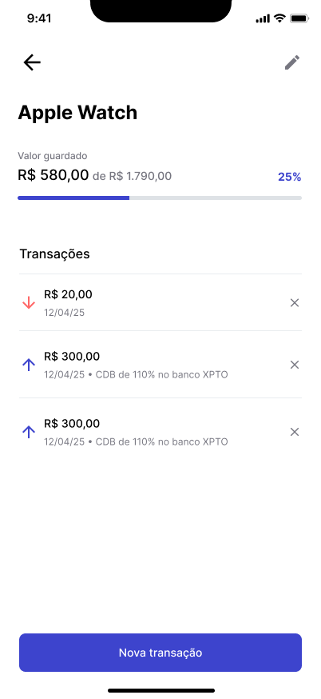

# Target

Target é um aplicativo mobile desenvolvido para ajudar pessoas a organizar e alcançar suas metas financeiras de forma simples e intuitiva. Com ele, você pode definir objetivos, acompanhar o progresso de cada meta e registrar todas as transações relacionadas, mantendo o controle total sobre suas finanças pessoais.

## Principais Funcionalidades

- **Cadastro de Metas:** Defina objetivos financeiros, como comprar um produto, fazer uma viagem ou investir.
- **Registro de Transações:** Adicione entradas (depósitos) e saídas (resgates) vinculadas a cada meta, detalhando valores e motivos.
- **Acompanhamento do Progresso:** Visualize o quanto já foi poupado em relação ao valor alvo de cada meta, com indicadores percentuais e gráficos de progresso.
- **Resumo Financeiro:** Veja o total disponível, somatório de entradas e saídas, e o status de todas as suas metas em uma tela inicial clara e objetiva.
- **Gestão Simples:** Edite ou exclua metas e transações a qualquer momento, mantendo seus dados sempre atualizados.

## Tecnologias Utilizadas

- [React Native](https://reactnative.dev/)
- [Expo](https://expo.dev/)
- [expo-sqlite](https://docs.expo.dev/versions/latest/sdk/sqlite/)
- [Day.js](https://day.js.org/)
- [TypeScript](https://www.typescriptlang.org/)

## Imagens do Projeto

### Tela de Nova Transação


### Cadastro de Nova Meta


### Edição de Meta


### Tela Inicial (Resumo e Metas)


### Detalhes da Meta e Transações


## Instalação

1. Clone o repositório:
   ```sh
   git clone <url-do-repositorio>
   cd target
   ```

2. Instale as dependências:
   ```sh
   npm install
   ```

3. Inicie o projeto:
   ```sh
   npm run start
   ```

## Scripts

- `npm run android` — Executa no Android
- `npm run ios` — Executa no iOS
- `npm run web` — Executa no navegador

## Sobre

Este projeto foi criado com o objetivo de facilitar o planejamento financeiro pessoal, tornando o processo de poupar e investir mais visual, prático e motivador.

---
